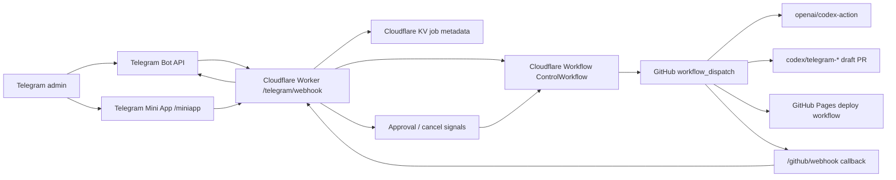

# Telegram Autonomous Control Plane

ZenFlow now has a Telegram-first control-plane scaffold that is separate from the product runtime:

- Worker source: `tools/telegram-control/`
- Cloudflare config: `tools/telegram-control/wrangler.jsonc`
- GitHub workflow: `.github/workflows/telegram-control.yml`
- Mini App route: `/miniapp`
- Completion/sync proof anchors: `docs/ai/TASK_COMPLETION_PROTOCOL.md`, `docs/ai/TELEGRAM_GRADE_RUNTIME_CONTRACT.md`, and `docs/ai/SYNC_CONTRACT.md`

## Architecture



The v1 runtime uses Cloudflare Workers plus Cloudflare Workflows because it can run without a permanent paid host. Temporal remains a future adapter target: the command/job/signal types are intentionally close to Temporal message-passing vocabulary, but v1 does not require a Temporal server.

## Command Contract

`CommandIntent`:

```ts
{
  kind: "status" | "health" | "plan" | "fix" | "review" | "test" | "security" | "deploy" | "rollback" | "jobs" | "cancel" | "approve" | "deny" | "ask";
  prompt: string;
  targetRef: string;
  riskLevel: "low" | "medium" | "high";
  requiresConfirmation: boolean;
  requestedGates: string[];
}
```

`ControlJob`:

```ts
{
  id: string;
  requesterTelegramId: number;
  status: "ASK" | "awaiting_approval" | "queued" | "running" | "succeeded" | "failed" | "cancelled" | "denied" | "unverified";
  githubRunId?: number;
  branch?: string;
  prUrl?: string;
  approvals: ApprovalRecord[];
  evidence: string[];
}
```

`ApprovalSignal`:

```ts
{
  jobId: string;
  action: "approve" | "deny" | "cancel";
  nonce: string;
  telegramUserId: number;
}
```

## Security Boundaries

- Telegram requests must include `X-Telegram-Bot-Api-Secret-Token`.
- Telegram users must be allowlisted in `TELEGRAM_ADMIN_IDS`.
- GitHub webhooks must verify `X-Hub-Signature-256`.
- GitHub Actions callbacks must send `X-Zenflow-Control-Secret`.
- Mini App API calls must send `Authorization: tma <Telegram.WebApp.initData>` and pass server-side HMAC validation.
- Approval callback data includes a nonce stored on the job.
- Approval-gated jobs start a Cloudflare Workflow immediately; approve, deny, and cancel actions are delivered as Workflow events before any GitHub dispatch.
- Worker KV stores metadata only; no ZenFlow user content is stored.
- AI work is branch-scoped to `codex/telegram-*`.
- Production deploy is only dispatched after Telegram approval and only from `main`.
- Missing `OPENAI_API_KEY` is reported as `UNVERIFIED`, never as success.
- `secrets:bootstrap` may generate only project-owned random shared secrets. It must not generate or print account-owned credentials such as Telegram bot tokens, GitHub App private keys, or OpenAI API keys.

## No-Budget Constraint

This implementation avoids a permanent paid host. Cloudflare Workers/Workflows and GitHub Actions can fit a no-subscription v1, subject to their free-tier limits. OpenAI API execution still requires an existing API key or credits; there is no unlimited free Codex API path.

## Official References

- [Telegram Bot API](https://core.telegram.org/bots/api)
- [Telegram Mini Apps](https://core.telegram.org/bots/webapps)
- [GitHub workflow dispatch REST API](https://docs.github.com/en/rest/actions/workflows)
- [Cloudflare Workers limits](https://developers.cloudflare.com/workers/platform/limits/)
- [Cloudflare Workflows](https://developers.cloudflare.com/workflows/)
- [Cloudflare Workflow events](https://developers.cloudflare.com/workflows/build/events-and-parameters/)
- [OpenAI Codex Action](https://github.com/openai/codex-action)
- [OpenAI tools and MCP](https://developers.openai.com/api/docs/guides/tools-connectors-mcp)
- [Supabase Edge Functions](https://supabase.com/docs/guides/functions)
- [Temporal TypeScript message passing](https://docs.temporal.io/develop/typescript/workflows/message-passing)

## Acceptance Scenarios

- Unauthorized Telegram user is rejected before any GitHub dispatch.
- `/status` and `/health` return state without starting Codex.
- `/fix ...` creates a GitHub control job and dispatches branch-scoped work.
- `/deploy` stops at Telegram approval before dispatch, then queues the existing GitHub Pages deploy workflow from `main`.
- `/rollback target=<commit-or-ref>` requires Telegram approval, creates a `codex/telegram-*` branch, reverts the target, runs gates, and opens a draft PR. It does not deploy directly.
- Missing `OPENAI_API_KEY` returns `UNVERIFIED`.
- Failed CI reports failure evidence back through `/github/webhook`.
- A Telegram-approved production deploy from any ref other than `main` is rejected.
- `/miniapp/state` rejects missing or invalid Telegram init data.
- `/miniapp/command` uses the same command parser and destructive approval gate as chat commands.

## Verification Checklist

- `npm run check:telegram-control`
- `npm --prefix tools/telegram-control run activation:run`
- `npm --prefix tools/telegram-control run activation:checklist`
- `npm --prefix tools/telegram-control run activation:doctor`
- `npm --prefix tools/telegram-control run activation:doctor -- --github --cloudflare`
- `npm --prefix tools/telegram-control run setup:kv -- --dry-run`
- `npm --prefix tools/telegram-control run secrets:bootstrap`
- `npm --prefix tools/telegram-control run secrets:install-generated -- --dry-run`
- `npm --prefix tools/telegram-control run set-github-callback-url -- --dry-run --base-url https://example.invalid`
- `npm --prefix tools/telegram-control run activation:checklist -- --cloudflare`
- `npm --prefix tools/telegram-control run setup:plan`
- `npm --prefix tools/telegram-control run check:secrets`
- `npm --prefix tools/telegram-control run verify:config`
- `npm --prefix tools/telegram-control run check:workflow`
- `npm --prefix tools/telegram-control run smoke:local`
- `npm --prefix tools/telegram-control run smoke:live`
- `npm --prefix tools/telegram-control run set-webhook -- --dry-run`
- `npm run typecheck`
- `npm run lint`
- `npm run check:task-completion`
- `npm run check:sync-contract`
- `npm run check:all`
- `npm --prefix tools/telegram-control run deploy:dry-run`
- `snyk code test` when Snyk auth/tooling is available

Any item without current command output must be marked `UNVERIFIED`.

## Operator Setup Flow

1. Create a Telegram bot through BotFather and keep the token outside git.
2. Create or bind the free-tier Cloudflare KV namespace with `npm --prefix tools/telegram-control run setup:kv -- --dry-run`, then `npm --prefix tools/telegram-control run setup:kv -- --create --write` after `wrangler login`, or `npm --prefix tools/telegram-control run setup:kv -- --namespace-id <cloudflare-kv-id> --write` if the namespace already exists.
3. Run `npm --prefix tools/telegram-control run secrets:bootstrap -- --write-local` to generate local project-owned shared secrets, then run `npm --prefix tools/telegram-control run secrets:install-generated -- --cloudflare` after `wrangler login`; never place secret values in `wrangler.jsonc`.
4. Deploy the Worker after `deploy:dry-run` passes.
5. Set `TELEGRAM_WEBHOOK_URL=https://<worker-host>/telegram/webhook` locally and run `npm --prefix tools/telegram-control run set-webhook`.
6. Configure the GitHub App and GitHub workflow secrets. If `gh` is authenticated, use `npm --prefix tools/telegram-control run secrets:install-generated -- --github` for `TELEGRAM_CONTROL_CALLBACK_SECRET`; after the Worker URL exists, run `npm --prefix tools/telegram-control run set-github-callback-url -- --github` to store `TELEGRAM_CONTROL_CALLBACK_URL`. Use `npm --prefix tools/telegram-control run activation:checklist -- --github` or `npm --prefix tools/telegram-control run activation:doctor -- --github --cloudflare` to verify GitHub secret names, Cloudflare auth, callback URL shape, `OPENAI_API_KEY`, and optional `SNYK_TOKEN` without reading values.
7. Send `/health` from the allowlisted Telegram account. Treat any missing secret or placeholder binding as `UNVERIFIED`, not operational.
8. Run `npm --prefix tools/telegram-control run smoke:live` with `TELEGRAM_CONTROL_BASE_URL`; add `TELEGRAM_BOT_TOKEN` and `TELEGRAM_ADMIN_ID` to verify authenticated Mini App state.
9. After every prerequisite above is ready, run `npm --prefix tools/telegram-control run activation:run -- --apply --kv --cloudflare-secrets --github-secrets --deploy --github-callback --telegram --live-smoke --external-checks` from the prepared operator shell. Without `--apply`, the same runner remains dry-run/report-only.
10. Run `npm --prefix tools/telegram-control run check:secrets` before committing or sharing setup files.
