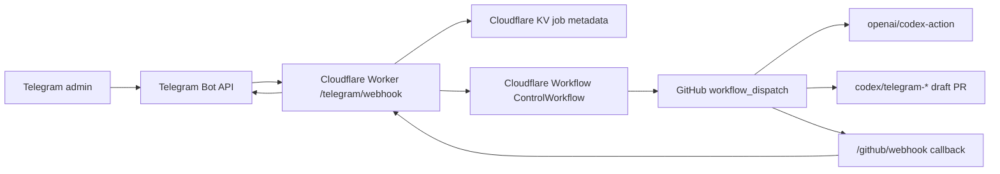

# Telegram Autonomous Control Plane

ZenFlow now has a Telegram-first control-plane scaffold that is separate from the product runtime:

- Worker source: `tools/telegram-control/`
- Cloudflare config: `tools/telegram-control/wrangler.jsonc`
- GitHub workflow: `.github/workflows/telegram-control.yml`
- Completion/sync proof anchors: `docs/ai/TASK_COMPLETION_PROTOCOL.md`, `docs/ai/TELEGRAM_GRADE_RUNTIME_CONTRACT.md`, and `docs/ai/SYNC_CONTRACT.md`

## Architecture



The v1 runtime uses Cloudflare Workers plus Cloudflare Workflows because it can run without a permanent paid host. Temporal remains a future adapter target: the command/job/signal types are intentionally close to Temporal message-passing vocabulary, but v1 does not require a Temporal server.

## Command Contract

`CommandIntent`:

```ts
{
  kind: "status" | "health" | "plan" | "fix" | "review" | "test" | "security" | "deploy" | "rollback" | "jobs" | "cancel" | "approve" | "deny" | "ask";
  prompt: string;
  targetRef: string;
  riskLevel: "low" | "medium" | "high";
  requiresConfirmation: boolean;
  requestedGates: string[];
}
```

`ControlJob`:

```ts
{
  id: string;
  requesterTelegramId: number;
  status: "ASK" | "awaiting_approval" | "queued" | "running" | "succeeded" | "failed" | "cancelled" | "denied" | "unverified";
  githubRunId?: number;
  branch?: string;
  prUrl?: string;
  approvals: ApprovalRecord[];
  evidence: string[];
}
```

`ApprovalSignal`:

```ts
{
  jobId: string;
  action: "approve" | "deny" | "cancel";
  nonce: string;
  telegramUserId: number;
}
```

## Security Boundaries

- Telegram requests must include `X-Telegram-Bot-Api-Secret-Token`.
- Telegram users must be allowlisted in `TELEGRAM_ADMIN_IDS`.
- GitHub webhooks must verify `X-Hub-Signature-256`.
- GitHub Actions callbacks must send `X-Zenflow-Control-Secret`.
- Approval callback data includes a nonce stored on the job.
- Worker KV stores metadata only; no ZenFlow user content is stored.
- AI work is branch-scoped to `codex/telegram-*`.
- Missing `OPENAI_API_KEY` is reported as `UNVERIFIED`, never as success.

## No-Budget Constraint

This implementation avoids a permanent paid host. Cloudflare Workers/Workflows and GitHub Actions can fit a no-subscription v1, subject to their free-tier limits. OpenAI API execution still requires an existing API key or credits; there is no unlimited free Codex API path.

## Official References

- [Telegram Bot API](https://core.telegram.org/bots/api)
- [Telegram Mini Apps](https://core.telegram.org/bots/webapps)
- [GitHub workflow dispatch REST API](https://docs.github.com/en/rest/actions/workflows)
- [Cloudflare Workers limits](https://developers.cloudflare.com/workers/platform/limits/)
- [Cloudflare Workflows](https://developers.cloudflare.com/workflows/)
- [OpenAI Codex Action](https://github.com/openai/codex-action)
- [OpenAI tools and MCP](https://developers.openai.com/api/docs/guides/tools-connectors-mcp)
- [Supabase Edge Functions](https://supabase.com/docs/guides/functions)
- [Temporal TypeScript message passing](https://docs.temporal.io/develop/typescript/workflows/message-passing)

## Acceptance Scenarios

- Unauthorized Telegram user is rejected before any GitHub dispatch.
- `/status` and `/health` return state without starting Codex.
- `/fix ...` creates a GitHub control job and dispatches branch-scoped work.
- `/deploy` and `/rollback` stop at Telegram approval before dispatch.
- Missing `OPENAI_API_KEY` returns `UNVERIFIED`.
- Failed CI reports failure evidence back through `/github/webhook`.

## Verification Checklist

- `npm run check:telegram-control`
- `npm --prefix tools/telegram-control run activation:checklist`
- `npm --prefix tools/telegram-control run verify:config`
- `npm --prefix tools/telegram-control run check:workflow`
- `npm --prefix tools/telegram-control run smoke:local`
- `npm --prefix tools/telegram-control run set-webhook -- --dry-run`
- `npm run typecheck`
- `npm run lint`
- `npm run check:task-completion`
- `npm run check:sync-contract`
- `npm run check:all`
- `npm --prefix tools/telegram-control run deploy:dry-run`
- `snyk code test` when Snyk auth/tooling is available

Any item without current command output must be marked `UNVERIFIED`.

## Operator Setup Flow

1. Create a Telegram bot through BotFather and keep the token outside git.
2. Create a Cloudflare KV namespace and replace `REPLACE_WITH_CLOUDFLARE_KV_NAMESPACE_ID` in `tools/telegram-control/wrangler.jsonc`.
3. Set Cloudflare secrets with `wrangler secret put`; never place secret values in `wrangler.jsonc`.
4. Deploy the Worker after `deploy:dry-run` passes.
5. Set `TELEGRAM_WEBHOOK_URL=https://<worker-host>/telegram/webhook` locally and run `npm --prefix tools/telegram-control run set-webhook`.
6. Configure the GitHub App and GitHub workflow secrets.
7. Send `/health` from the allowlisted Telegram account. Treat any missing secret or placeholder binding as `UNVERIFIED`, not operational.
