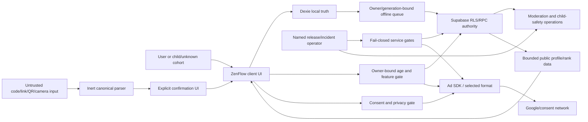

# Threat Model: Android 2.1, All-Ages Public Social, QR and Monetization

**Date:** 2026-08-11  
**Status:** planning threat model; implementation/runtime validation absent  
**Risk:** high / child-and-privacy sensitive  
**Default:** public social, child/unknown discovery/contact, QR writes and monetization are OFF

## 1. Scope and assumptions

### In scope

- ZenFlow Web/PWA/Android/iOS/Desktop clients and the shared React/Dexie state path;
- Supabase auth, RLS/RPC, sync/event/outbox/tombstone/backup behavior;
- public profiles/search, global leaderboard, challenge ranking, Friends/Challenges;
- manual invitation codes, links, app/universal links, static QR and camera scan;
- report/block, UGC moderation, child-safety escalation, deletion/retention;
- AdMob/UMP/age/consent/geography/frequency/lifecycle boundaries;
- Android native Back/links/camera/plugins, exact AAB and evidence/operations.

### Explicitly out of scope for implementation in this audit

- production code, migrations, RPCs, dependencies, Edge Functions or flags;
- live data, real-user abuse testing, DAST, console writes or deployment;
- handling secrets/credentials or publishing policy/legal text;
- selecting all-ages cohorts, moderation staffing, legal posture or monetization option.

### Assumptions that remain `UNVERIFIED`

- expected user/traffic/query/report volume and adversary capacity;
- exact public profile fields and ranking formula;
- whether under-13 is an intended production cohort;
- identity/availability/SLA of moderation and child-safety operators;
- jurisdiction, retention, lawful basis, transfer and law-enforcement process;
- exact QR library, signature/nonce design and server invitation RPC;
- exact voluntary non-reward ad format if ADR-MON-001 option B is selected;
- live Supabase schema parity, signing config and exact release artifact.

No assumptions above may be filled with model guesses. They are owner/external gates.

## 2. System and trust boundaries

Trust-boundary rules:

1. Links, manual codes, QR pixels, deep-link intents, camera frames and public profile fields are untrusted input.
2. Client state is not authority for age, relationship, membership, rank, block status or eligibility.
3. Dexie is local truth for the user's private app state; public authorization and global/challenge rank require server authority.
4. Offline queue entries remain untrusted until validated under current owner/account generation and server authorization.
5. AdMob/Play/UMP console labels and callbacks are external signals, not product/value/release proof.
6. Evidence/logging is a separate egress boundary and must exclude private prose, secrets, raw QR payloads and unnecessary identifiers.
7. Moderation, child-safety and incident operators are privileged human boundaries requiring least privilege, audit and availability.

## 3. Assets and security objectives

| Asset | Objective |
|---|---|
| Diary, habits, moods and planning | confidentiality, owner binding, durability, no ad/social exposure |
| Account/age/consent state | integrity, minimum collection, anti-spoofing, current-state gating |
| Friendship/challenge membership | server-authoritative integrity, block/deletion enforcement, anti-replay |
| Public profile/search results | bounded disclosure, anti-enumeration/scraping, child/blocked-user safety |
| Global/challenge ranks | server-authoritative calculation, anti-forgery, fair pagination/ties, deletion semantics |
| Invitation/link/QR payload | canonical validation, expiry/revocation/audience binding, zero pre-confirm side effect |
| Reports/moderation evidence | confidentiality, integrity, need-to-know access, bounded retention, safe escalation |
| Offline queue/sync/tombstones | idempotency, ordering, owner/generation fence, anti-resurrection |
| Ad/consent/frequency state | fail-closed integrity, no private payload, no core-action dependency |
| Release artifact/config | identity, signing/hash/version/config integrity, reproducible evidence |
| Logs/telemetry/evidence | data minimization, fixed codes, bounded identifiers, access/retention control |

## 4. Attacker profiles

- unauthenticated scraper enumerating public profiles/ranks/invite endpoints;
- authenticated abusive user targeting a child, blocked user or challenge member;
- malicious participant forging score/membership or replaying an invitation;
- stalker correlating display name, rank, activity timing, challenge membership or QR payload;
- spammer creating accounts/invites/reports to exhaust users/moderators;
- hostile website/app sending crafted deep links or intents;
- malicious QR placed in physical/digital space;
- compromised/buggy client or stale offline queue replaying another owner's operation;
- insider/moderator exceeding need-to-know access;
- supply-chain attacker in a QR/ad/native dependency;
- network adversary causing consent/ad retries, callback reordering or state desynchronization;
- release operator error: wrong project, artifact, percentage, declaration, certificate or gate.

## 5. Abuse cases and required controls

| ID | Threat / abuse path | Impact | Required prevention/detection | Validation | Residual status |
|---|---|---|---|---|---|
| TM-001 | IDOR reads/changes another profile, friendship, challenge, report or block | privacy/safety/data integrity | owner/cohort-aware RLS; RPC authorization; opaque IDs; negative cross-account tests | RLS/RPC contract + adversarial runtime | UNVERIFIED |
| TM-002 | Profile search enumerates users/children | stalking/scraping | child/unknown OFF; bounded query/result fields; rate limits; anti-enumeration; no exact existence oracle | distributed/rate/search tests | UNVERIFIED |
| TM-003 | Global rank leaks identity/activity or is scraped | safety/privacy/pressure | explicit opt-in/cohort rule; minimal display; pagination/rate limits; block/delete enforcement | API/UI/privacy tests + owner decision | ASK/UNVERIFIED |
| TM-004 | Client forges score/rank or challenge membership | integrity/fairness | server-derived inputs/rank; signed/authorized events; idempotency; anomaly detection | tamper/replay/rank contract tests | UNVERIFIED |
| TM-005 | Blocked/deleted user remains visible/contactable | safety/privacy | block at query/RPC boundary; cache invalidation; tombstones; moderation exceptions narrowly scoped | block/delete/offline/restart tests | UNVERIFIED |
| TM-006 | Invite replay/self/duplicate/cross-account/cross-type | unwanted contact/state corruption | versioned canonical schema; audience/owner/type/expiry/revocation; stable idempotency key | parser/RPC/restart tests | UNVERIFIED |
| TM-007 | QR/link decode auto-joins, writes or opens hostile origin | hidden action/phishing | allowlisted scheme/origin; inert parse; preview; explicit confirm after current auth/age/block checks | hostile link/QR/app-intent matrix | UNVERIFIED |
| TM-008 | Oversized/malformed QR causes DoS/parser exploit | crash/resource abuse | strict byte/dimension/time bounds; maintained dependency; fail closed; fuzzing | fuzz/size/time/device tests | UNVERIFIED |
| TM-009 | Camera frames or QR payloads retained/logged | privacy leakage | on-device ephemeral processing; no frame persistence; raw payload redaction; least permission | storage/log/network inspection | UNVERIFIED |
| TM-010 | Hardcoded fallback creates fake friend/challenge/rank | deception/data corruption | explicit loading/empty/unavailable/error; no production fixture reachability | PDI/source/bundle/runtime negative controls | UNVERIFIED |
| TM-011 | User sends abusive/sexual/violent/spam content | user/child harm | terms acceptance; report/block; proactive rules where applicable; moderation queue/SLA; escalation | flow tests + staffed operations drill | OWNER/EXTERNAL |
| TM-012 | CSAM/CSAE report mishandled | severe child/legal harm | published standards; in-app reporting; qualified process/contact; preservation/removal/reporting per law | qualified review and controlled drill | OWNER/EXTERNAL |
| TM-013 | Report spam/brigading/retaliation | abuse/moderator overload | rate limits, dedupe, trust/risk signals, appeals, no reporter exposure | abuse simulations + ops metrics | UNVERIFIED |
| TM-014 | Moderator browses unnecessary private data | insider/privacy harm | least-privilege roles; case-scoped access; audited access; no diary data; retention limits | access review/audit test | OWNER/EXTERNAL |
| TM-015 | Unknown/child treated as adult | unsafe social/ad exposure | neutral owner-approved age state; server binding; unknown OFF; no content-based inference | spoof/account-switch/restore tests | ASK/UNVERIFIED |
| TM-016 | Consent is stale/withdrawn but ad request occurs | privacy/policy violation | launch refresh; current `canRequestAds`; privacy options; stale/error/offline OFF | UMP geography/withdraw/restart tests | UNVERIFIED |
| TM-017 | Ad includes private journal/mood/habit content | sensitive data disclosure | hard exclusion map; minimal contextual data; payload/network inspection | canary interception + route tests | UNVERIFIED |
| TM-018 | Ad before save or automatic post-action fullscreen ad | interruption/coercion/data loss | core commit independent; no auto trigger; optional surface outside private flow | habit/journal failure/lifecycle tests | UNVERIFIED |
| TM-019 | Fake treats/XP/reward is issued or duplicated | deception/economy corruption | no reward model; legacy OFF; ADR owner gate; duplicate callback/restart negative controls | source/reachability/runtime audit | LEGACY / UNVERIFIED |
| TM-020 | Unbounded frequency pressures users | agency/emotional harm | owner-approved cap; durable fail-closed clock; child/unknown OFF; console/runtime parity | boundary/restart/time-shift tests | UNVERIFIED |
| TM-021 | No-fill/network/callback race mutates core state | data integrity/UX | separate ad state machine; bounded timeouts; at-most-once optional side effect; core immutable | network/no-fill/reorder/process-death tests | UNVERIFIED |
| TM-022 | Offline queue replays after account switch | cross-owner data change | owner/account-generation fence at decrypt, RPC and apply; stale discard/compensation | race tests + live safe smoke | local old evidence; current runtime UNVERIFIED |
| TM-023 | Delete/purge data resurrects through sync/backup/N-1 | privacy/data integrity | tombstones, monotonic purge marker, forward-only binary rule, replace authorization | deletion/import/upgrade tests | local old evidence; exact release UNVERIFIED |
| TM-024 | Diagnostics/evidence leak secrets or prose | confidentiality | fixed codes/allowlists/redaction; no raw console IDs/camera/diary; access/retention | private canary + secrets scans | bounded local PASS; runtime UNVERIFIED |
| TM-025 | QR/ad dependency is compromised or overprivileged | supply-chain/device compromise | exact source/version/license approval; SCA/SAST; pinning; minimal permissions; update/kill plan | provenance/scanners/runtime | BLOCKED by owner decision |
| TM-026 | Wrong Supabase/Play/AdMob/Firebase target is changed | production integrity | explicit target read-back; least privilege; dry/read-only first; owner checkpoint; post-write read-back | redacted external receipts | OWNER/EXTERNAL |
| TM-027 | Wrong/rebuilt AAB is promoted | supply-chain/release integrity | commit/input/hash/cert/version binding; same-AAB stages; artifact inventory checks | exact AAB/internal/Play hash receipts | UNVERIFIED |
| TM-028 | Rollout expands without operator/telemetry/rollback | availability/safety | named operator/alerts/thresholds/windows; explicit stage approvals; forward replacement | ops drill + staged evidence | OWNER/EXTERNAL |

## 6. Security requirements by boundary

### Client and local storage

- Treat all public/QR/link fields as untrusted display data; escape/render safely.
- Do not store raw camera frames or unnecessary public search history.
- Pending invite intent is bounded, owner/account-generation scoped, expiring and inert.
- No UI optimism establishes friendship, membership or rank before authoritative acceptance.
- Private ZenFlow records never enter public profile/rank/invite/ad payloads.
- Offline/error states are truthful and do not create placeholder users/challenges/success.

### Server/data authority

- RLS/RPC authorization is enforced independently of client gates.
- Search uses bounded prefixes/tokens and rate limits without a precise existence oracle.
- Rank inputs and results are server-authoritative, deterministic and auditable without exposing private detail.
- Block/delete/cohort eligibility is applied inside every public query and mutation.
- Invite tokens/codes are high entropy, scoped, expiring, revocable and at-most-once/idempotent where required.
- Reports/moderation access is role-scoped, audited and separate from diary/private app data.
- Tombstones/purge/account generation prevent stale replay and resurrection.

### Age/consent/ads

- Missing, stale, malformed, offline or unknown age/consent/gate state is OFF.
- Age cannot be inferred from journal content, mood, behavior or advertising identifiers.
- Consent withdrawal prevents future requests and keeps privacy options reachable.
- Frequency state does not become cross-context fingerprinting and fails safely on clock anomalies.
- No reward value, callback or copy is active without an independently approved genuine reward product.
- Core actions never wait for, trigger, or roll back because of ad behavior.

### Operations/release

- Exact project/app/artifact/percentage targets are read back before and after external action.
- Evidence is redacted and hash-bound without identifiers/secrets/private content.
- Feature/ad gates have kill-switch precedence and bounded freshness.
- Public social remains OFF if moderation/child-safety operator coverage is unavailable.
- Release remains STOP without named incident ownership, alerts and forward-compatible replacement.

## 7. Validation plan

1. Static contracts: schema/RLS/RPC/parser/rank/queue/age/consent/release config.
2. Negative unit/property/fuzz tests: malformed/oversized/replay/cross-owner/block/delete/callback/clock.
3. Integration tests: Dexie → queue → server authority → tombstone/refresh with owner switches.
4. Browser/native runtime: route, link/QR, camera permission, Back/lifecycle, offline/restart and accessibility.
5. Security scanning: repository security suite, Snyk Code for modified first-party languages, dependency provenance/SCA and secret scans.
6. Authenticated safe external validation only at explicit gates: dedicated smoke account, test ads/Ad Inspector, exact Play/AdMob/Supabase target.
7. Human/qualified validation: child-safety/legal/moderation/AT/cultural/artistic review.
8. Exact-artifact validation: generated splits from one signed AAB and same-hash internal/staged operation.

No DAST target, real-user data, live ad traffic or adversarial child interaction is authorized in this audit.

## 8. Residual risk and release decision

Current residual risk is unacceptable for enabling public all-ages social, QR mutations or monetization. The design/operator/legal/age/backend/runtime/exact-artifact gates are unresolved. Therefore:

- public profiles/search/global ranking/challenge ranking/invites/QR: `STOP`;
- child/unknown public discovery/contact: `STOP`;
- legacy reward/rewarded path: `LEGACY / UNVERIFIED`, OFF;
- monetization ON: `STOP` pending ADR-MON-001 and selected-option proof;
- core app: may continue with optional tracks OFF, subject to independent release blockers;
- Android 2.1 release: `STOP` until exact artifact, store truth, internal testing and operations gates pass.
