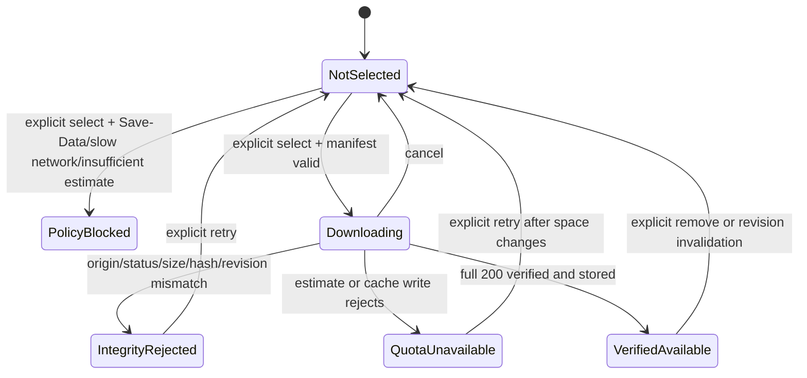
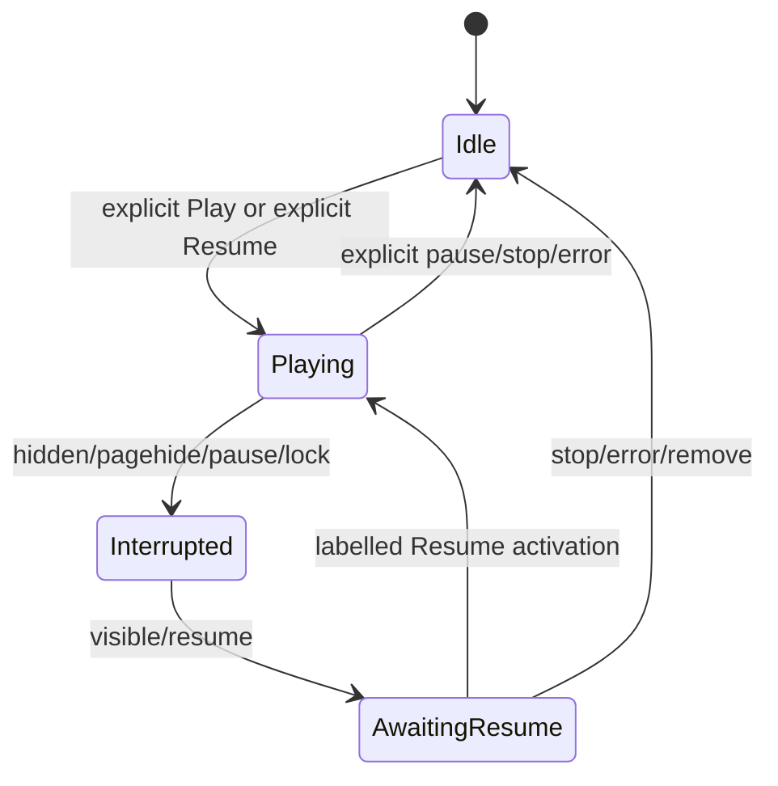

# Data model and lifecycle

## Authority boundary

No ZenFlow personal record is created or modified. Dexie/IndexedDB remains the local truth for moods, habits, journal, focus, gratitude, and related sync data. The feature’s cache metadata is browser cache state for first-party static audio only; it must not be written into a user entity, sync queue, analytics event, export, or diagnostic payload.

## Entities

| Entity | Fields | Authority and retention |
|---|---|---|
| `PwaAudioCacheEntry` | exact `path`, `sha256`, `bytes`, `revision`, `group` | Generated from existing tracked audio inventory at build/check time. Immutable per release revision; no user content. |
| `PwaAudioOfflineState` | exact union `uncached | downloading | cached | paused | quota_blocked | invalid | unavailable` | In-memory/cache-derived state only; never used as proof that personal data is durable or synced. |
| `SelectedAudioDownload` | `assetId`, `revision`, `state: PwaAudioOfflineState`, `receivedBytes`, `totalBytes`, `abortToken`, `failureKind` | In-memory state owned by the initiating PWA control. Cleared on completion/cancel/error/unmount. Never syncs. |
| `VerifiedAudioCacheRecord` | `cacheKey`, `assetId`, `revision`, `verifiedAt`, `byteSize` | Revisioned service-worker cache entry only after full-response verification. Removed by explicit selected-item delete, invalidation, or bounded browser eviction. |
| `InterruptedPlayback` | `surface`, `assetId`, `resumeEligible`, `interruptedAt`, `locale` | In-memory originating-control state. Created by interruption, cleared by explicit resume/stop/error/removal. No automatic playback transition. |
| `DurableCueBoundary` | `actionEventId`, `localCommitState`, `nonAudioFeedback` | Derived at each existing persistence owner. `localCommitState=resolved` is required before cue invocation; never persists independently. |

## State transitions

## Validation invariants

1. A cache write has one manifest item and a same-origin resolved URL under the current Vite base path.
2. Only `200` full bodies can gain `VerifiedAudioCacheRecord`; `206`, opaque, redirected cross-origin, missing `Content-Length` when required, wrong byte count, wrong SHA-256, and wrong revision cannot.
3. At most one selected long-track download is active per browser client; cross-client coalescing must not claim a download owner that does not exist.
4. Cache deletion accepts one current selected revision key, never a wildcard cache name, unrelated cache, or unselected item.
5. `InterruptedPlayback` is not authorization to call `play`; its only transition to Playing is the accessible originating Resume control or a Media Session action mapped to that same handler.
6. `DurableCueBoundary` cannot be created by UI optimism, an outbound sync acknowledgement, or an exception path; it follows local commit only.
7. `StorageManager.estimate()` and `persist()` are reachable only from the explicit selected-track offline-download action; neither cold launch, Play without offline selection, Settings mount, retry timer, nor query flags may call them.
8. `audioUnlocked` remains false unless an awaited media-element play succeeds or the inspected audio context is actually `running`.

## Migration, sync, deletion, recovery

There is no Dexie schema migration, Supabase mutation, sync record, tombstone, backup, export, or account-scoped deletion. Cache keys are release-revisioned static artifacts. If an entry is corrupt/stale, recovery deletes only that key, marks offline use unavailable, and asks for a new explicit selection when online. App uninstall/browser storage clear removes caches by browser policy and must be shown as unavailable, not reconstructed from synthetic data.
