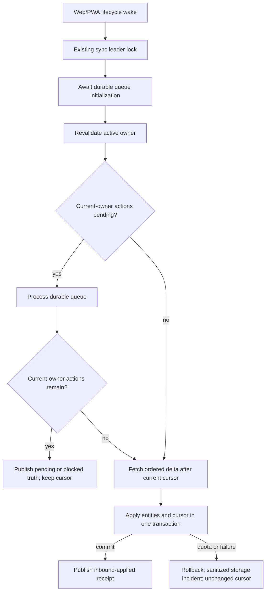

# Implementation Plan: PWA Sync Continuity

**Feature**: [spec.md](spec.md)
**Branch**: `codex/pwa-quality-20260809`
**Baseline HEAD**: `13ca51a80d23220574deba762851fe5a32372e46`
**Primary target**: Installed PWA, with Web/Vite parity
**Scope boundary**: No schema, migration, native wrapper, dependency, production write, deployment, or publication.

## Summary

Refine existing ZenFlow sync and storage owners so Web/PWA users see evidence-backed continuity states, all delta triggers retain the durable outbound-before-inbound barrier, quota failure is an honest recoverable incident with cursor rollback, new content-bearing `localStorage` fallback writes stop, legacy queue data migrates atomically, and support diagnostics expose only symbolic route/coarse receipt data.

## Technical Context

| Area | Current owner / constraint | Planned treatment |
| --- | --- | --- |
| Local truth | Dexie/IndexedDB; Zustand is a hydrated mirror. | No schema change; preserve persistence-first writes. |
| Outbound queue | `src/lib/offlineQueue.ts`, owner-bound durable rows, origin-exclusive locks. | Remove new content fallback writer; preserve one-way legacy migrator; expose typed storage failure. |
| Delta owner | `src/hooks/useDeltaSyncEffects.ts`, leader lock and account generation. | Characterize all triggers and retain queue init/drain barrier before fetch. |
| Cursor/apply | `src/storage/eventSync.ts`, one Dexie transaction. | Add explicit rollback/quota regression proof; change only if the proof exposes a gap. |
| Truth UX | `SyncHealthCard`, `SyncHealthCardParts`, offline queue hook, recorder receipts. | Centralize deterministic derivation and four distinct meanings. |
| Storage incident | `StorageErrorBanner` and incident reducer. | Normalize/dedupe quota incident and safe retry in existing overlay owner. |
| Diagnostics | `syncHealthRecorder` and `useSyncHealthRuntime`. | Symbolic route, field allowlist, bounded enums/counts; remove raw search/hash. |
| Localization | Custom eight-locale typed dictionaries. | Add whole-thought keys with placeholder parity and ar/he bidi tests. |
| Platforms | Shared Vite bundle consumed by Web/PWA/native shells. | Web/PWA behavior only; native compatibility checked, no native edits. |

## AGENT_CHANGE_NOTICE

- **Risk level**: M2 protected storage/sync/privacy change.
- **Trigger**: Offline reopen can misstate continuity; fallback path can write content to `localStorage`; raw search is present in diagnostics; quota incident is incomplete.
- **Current evidence**: Source hashes and exact findings are retained in `evidence/preimplementation-analysis.md`.
- **Proposed write set**: Only shared TypeScript/React tests and implementation files listed under Project Structure plus eight locale dictionaries and this feature packet.
- **Platform/domain impact**: Intended Web/PWA behavior; Android/iOS/Desktop no intended behavior change but shared-bundle compatibility required; security/privacy, accessibility, i18n, testing, and operations affected.
- **Rollback**: One feature revert, with the legacy reader retained until rollback compatibility is proven; no schema/data rollback.
- **Verification**: RED/GREEN focused tests, contract/integrity/security/i18n/build/browser gates, diff path denylist, and explicit UNVERIFIED live/native/public rows.
- **Verdict**: GO for test-first implementation after the pre-implementation artifact review; no release authorization.

## Active Policy Gates

| Gate | Pre-implementation disposition |
| --- | --- |
| Test-first | Binding. Every production behavior change begins with the nearest RED test or current characterization baseline. |
| Sync contract | Binding. Queue-before-delta, leader/owner/cursor/gap/idempotency/tombstone invariants preserved. |
| Production data integrity | Binding. Test canaries stay isolated; no fake receipts or runtime fallback records. |
| No AI templates | Binding. Copy and artifacts are ZenFlow-specific; no placeholder or fake-complete evidence. |
| Translation quality | Binding for new copy; eight locales, whole thoughts, placeholder/bidi checks. |
| Cross-platform mandate | Binding. Five target statuses plus Store/Release are explicit. |
| Proposed Spec Kit constitution | `PROPOSAL_CRITERIA_ONLY`; considered but nonbinding and noncritical. |

## Constitution Check

The status gate returned `PROPOSED`, `ratified=false`, `activation=PROPOSAL_CRITERIA_ONLY`, `blocking_authority=false`. Its themes align with active repository rules (local truth, bounded authority, test-first evidence, cross-platform reporting), but no task, severity, or stop is derived solely from the proposal. Recheck after design: no divergence identified.

## Project Structure and Ownership

### Primary implementation files

```text
src/lib/offlineQueue.ts
src/main.tsx                                      # remove Web/PWA content-bearing lifecycle snapshot only
src/hooks/useDeltaSyncEffects.ts
src/storage/eventSync.ts                         # only if RED exposes a cursor/quota gap
src/observability/syncHealthRecorder.ts
src/hooks/useSyncHealthRuntime.ts
src/components/sync/SyncHealthCard.tsx
src/components/sync/SyncHealthCardParts.tsx
src/components/storageErrorIncidentState.ts
src/components/StorageErrorBanner.tsx
src/i18n/types.ts
src/i18n/languages/{en,uk,es,de,fr,ja,ar,he}.ts
```

### Test files

```text
src/lib/__tests__/offlineQueue.accountBoundary.test.ts
src/hooks/__tests__/useDeltaSyncEffects.test.ts
src/storage/__tests__/eventSync.test.ts
src/observability/__tests__/syncHealthRecorder.test.ts
src/components/sync/__tests__/SyncHealthCard.test.tsx
src/components/__tests__/StorageErrorBanner.pushRevocation.test.tsx
src/i18n/__tests__/syncContinuityTruthAndBidi.test.ts
```

### Forbidden write paths

```text
supabase/**
android/**
ios/**
src-tauri/**
package.json
package-lock.json
vite.config.*
src/sw.ts
ARCHITECTURE.md generated count block
.specify/** (outside this feature packet)
```

Any newly discovered need to edit a forbidden path changes scope and requires ASK; it is not silently absorbed.

## Architecture and State Flow



Truth presentation remains derived and ephemeral. It does not become a persisted store, second queue, or second delta owner.

## Implementation Phases

### Phase 0 - Baseline and RED evidence

1. Record current HEAD, source hashes, worktree status, and the exact allowed path set.
2. Run the existing focused queue/delta/recorder/card/storage tests as characterization.
3. Add failing tests for:
   - no new content-bearing fallback write after IndexedDB failure;
   - atomic legacy migration at every failure boundary;
   - every delta trigger's queue-before-fetch order and remaining-action block;
   - quota rollback preserving cursor/entities;
   - deterministic four-state truth and no empty-queue false confirmation;
   - deduplicated storage-full incident with safe retry;
   - diagnostic route/content/ID/OAuth/error canaries;
   - eight-locale placeholder and ar/he bidi safety.
4. Retain the expected RED reason and test count in an evidence receipt before production edits.

### Phase 1 - Durable queue boundary

1. Split legacy journal reading/migration from new persistence behavior in `offlineQueue.ts` without changing the Dexie table, and remove Web/PWA content-bearing lifecycle snapshot writes from `main.tsx` while retaining safe in-session failure state.
2. Make new/updated queue persistence fail explicitly on IndexedDB error; never call the content-bearing fallback writer.
3. Preserve one-way legacy validation, single-transaction reconciliation, committed-result confirmation, exact-key cleanup, idempotency, and owner quarantine.
4. Ensure removal/persist failures cannot create a new fallback journal or erase a newer operation.
5. GREEN the same queue tests, including corrupt input and cleanup failure negative controls.

### Phase 2 - Queue-before-delta and cursor/storage failure

1. Keep all existing lifecycle triggers routed through the same delta owner and leader lock.
2. Ensure durable initialization and current-owner re-read bracket queue processing.
3. Emit only coarse queue barrier receipts.
4. Confirm quota and all apply failures leave cursor/entity state unchanged; change `eventSync.ts` only if the RED proof identifies a real gap.
5. GREEN ordering, account-switch, duplicate, gap, and cursor tests.

### Phase 3 - Truth UX and storage incident

1. Extract the exact pure read-only `SyncContinuityState` derivation in the existing sync component module or a colocated helper; do not add persisted state.
2. Map local commit, pending, confirmed outbound, inbound applied, paused/offline, blocked, and storage-full states to localized whole thoughts; `Last sync` requires `confirmedOnlineAt`, otherwise use `Last activity`.
3. Prevent an older success receipt or connectivity from overriding current durable pending work.
4. Normalize storage failures to safe incident categories and route them through the existing banner/reducer.
5. Add one bounded retry that re-runs durable work, keeps focus/ARIA behavior, and deduplicates repeated incidents.
6. GREEN component and accessibility tests at narrow/desktop widths and ar/he directions.

### Phase 4 - Diagnostic sanitization

1. Replace raw route serialization with an allowlisted symbolic route resolver.
2. Convert receipt string fields to bounded enums; eliminate arbitrary error/action strings where they could leak.
3. Retain explicit opt-in, disable precedence, immutable snapshot copies, and the 30-receipt cap.
4. Add canary tests across snapshot, custom event, component DOM, and captured logger calls.
5. GREEN recorder, runtime, and SyncHealth component tests.

### Phase 5 - Blast radius and review

1. Run focused tests sequentially, then typecheck/lint/i18n/sync/integrity/security/build/browser checks in `quickstart.md`.
2. Inspect final diff/status and run a denylist check for schema/native/dependency/generated drift.
3. Compute SHA-256 for changed artifacts and retained evidence.
4. Keep installed PWA, Safari, live account, native, public deploy, and human translation proof `UNVERIFIED` until exact evidence exists.
5. Keep security `STOP` for the unchanged JS-readable Supabase session residual risk until the security owner explicitly accepts it or a separate auth-hardening feature is authorized.

## Security and Privacy

- No diagnostics or logs may contain journal/habit/mood/focus/gratitude/settings content, IDs, raw URLs, OAuth material, payloads, or arbitrary error messages.
- Tests use obvious synthetic canaries only inside isolated test files; they never enter shipped code or real-user storage/sync.
- Legacy migration reads only the exact known key, validates bounded structure, and does not enumerate unrelated browser storage.
- Account owner is checked before and after asynchronous work; another account's rows remain quarantined.
- No credential, support dump, live journal, production account, or production write is needed for local implementation proof.
- Run the narrow local security suite and preferred Snyk code scan if callable. Scanner unavailability is `UNVERIFIED`, never PASS.

## Accessibility and Localization

- Use existing theme tokens and `StorageErrorBanner`/`SyncHealthCard`; no hardcoded color or competing overlay.
- `role=status`/polite live announcements must not repeat on unchanged derived state.
- Retry control has visible focus, keyboard activation, and minimum 44px target.
- Copy uses user language: saved on this device, waiting to update, saved online, updates applied; no database/queue/localStorage/PWA jargon.
- All keys land in eight typed locale dictionaries in one change. Tests assert key and placeholder parity and wrap ar/he values in direction-safe component context.
- Automated parity does not establish native-speaker acceptance.

## Performance and Reliability Budgets

- No new startup network request, interval, service worker, or persisted status store.
- Queue initialization/drain remains on the existing lifecycle owner and leader lock.
- Legacy migration is bounded by the existing queue maximum and one transaction; no unbounded storage enumeration.
- Receipt history remains capped at 30; the user card renders at most the existing three pending rows and four recent receipts.
- Browser proof records no new long task over 50 ms attributable to truth derivation on the tested route; full low-end device performance remains `UNVERIFIED` without target evidence.
- Retries are finite and storage-full does not spin automatically.

## Platform Matrix

| Surface | Implementation | Required evidence | Release status before evidence |
| --- | --- | --- | --- |
| Web/Vite | Shared code and localized UI. | Focused tests, production build, browser online/offline/quota/canary scenarios. | UNVERIFIED |
| Installed PWA | Primary lifecycle behavior. | Install production-equivalent build; offline save, full close/reopen, update/network transitions. | UNVERIFIED |
| Android/Capacitor | No intended behavior/native edit. | Shared build/type tests plus owner device/emulator receipt. | UNVERIFIED |
| iOS/WKWebView | No intended behavior/native edit. | Shared build/type tests plus owner simulator/device receipt. | UNVERIFIED |
| Desktop/Tauri | No intended behavior/native edit. | Shared build/type tests plus owner desktop receipt. | UNVERIFIED |
| Store/Release | No action authorized. | Separate publication decision and release tracking. | N/A for this implementation |
| Accessibility | Existing semantic surfaces refined. | Testing Library, keyboard/ARIA, browser a11y and RTL/narrow viewport proof. | UNVERIFIED |
| Performance | Pure derivation and bounded migration/receipts. | Browser timing/long-task trace on production build. | UNVERIFIED |
| Security/Privacy | Storage and diagnostic boundary changes. | Canary tests, PDI, Snyk/security suite, diff review. | UNVERIFIED |
| Operations | Incident/retry and evidence ledger. | Retained command receipts, hashes, rollback rehearsal/review. | UNVERIFIED |

## Rollback

Rollback is a normal reviewable revert of the feature's shared TypeScript/React/i18n/test changes. Because no schema or external state changes, durable IndexedDB records remain compatible. Before rollback:

1. Confirm whether any user has migrated from the legacy journal.
2. Do not restore a content-bearing fallback writer as a quick fix.
3. Retain the one-way legacy reader if the prior version could strand a journal, or revert the whole behavior only after compatibility review.
4. Re-run queue migration, account-boundary, cursor atomicity, i18n, PDI, build, and browser checks on the rollback candidate.
5. If storage incidents regress, disable only the new presentation path while preserving durable failure behavior; never clear pending data.

## Evidence and Hash Strategy

- Bind discovery to baseline HEAD and source SHA-256 values in `evidence/preimplementation-analysis.md`.
- Store exact RED/GREEN command, exit code, timestamp, test count, and current HEAD/artifact hash in implementation receipts.
- Hash each final feature artifact and changed source file after the final write; the analysis document cannot self-authenticate and requires an external post-write hash receipt.
- A structural document check proves only artifact coherence, not runtime behavior.

## Gate Outcome

Pre-implementation plan verdict: **GO**. No active-policy CRITICAL conflict or STOP condition remains in the plan. Implementation and release are not authorized by this artifact; implementation proceeds only under the parent task's explicit authorization and test-first gate, while release requires separate evidence/authority.
